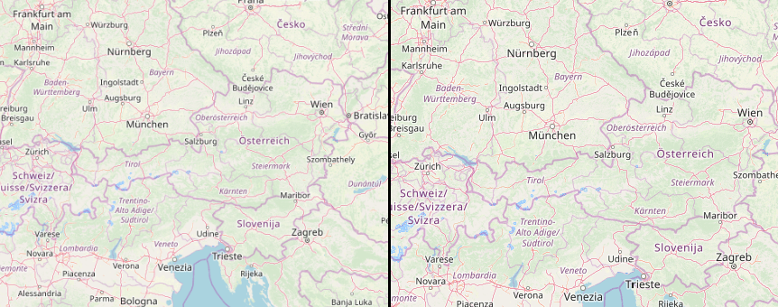

# Lock Zoom to Tile Scale (EPSG:3857 & EPSG:4326 only)

The purpose of this plugin is to match the QGIS zoom / resolution level of the canvas to match the zoom / resolution of the map server when TMS/XYZ or WMTS layers are added to QGIS. This plugin is primarily applicable to the WGS 84 Web Mercator (EPSG:3857) projection that is so prevalent on the Internet today. With EPSG:3857 the zoom resolution of each level is strictly defined.

The plugin can work with WGS84 (EPSG:4326) projections much of the time. For GeoServer map servers, EPSG:4236 zoom levels are strictly defined, but ESRI map servers are not. The hard coded EPSG:4326 settings in the plugin will perfectly match the settings from a GeoServer and will probably render a clearer picture for other map servers.

Once the plugin is installed, if you have a layer displayed and the project projection is either EPSG:3857 or EPSG:4326, then this plugin will be enabled. It can be selected from the toolbar with this icon  which is its unlocked state. If you press the button it will look like this  and the QGIS zoom level will be locked to the best zoom level for image clarity. The plugin can also be selected from ***Plugins->Lock zoom to tile scale->Lock zoom scale.***

In a coming release we may allow the user to select a layer to snapshot its fundamental resolutions for each zoom level and match the canvas to those resolutions. If you have any suggestions please let us know.

Look at this example.

The image on the left shows an Open Street Map layer that was initially displayed. The image on the right is what is displayed after the lock button was pressed. The results are somewhat subtle, but the clarity of the right image is better. This becomes more important if you are trying to read hard to read text.